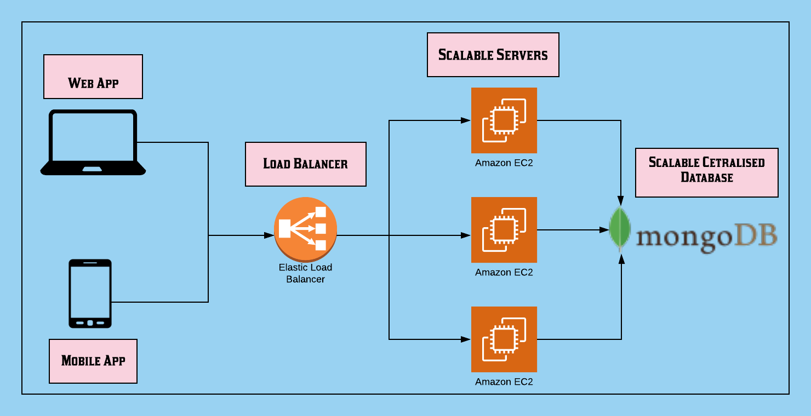

# Ideas in Bytes
Our team Ideas in Bytes created a tech solution to improve and optimise the work of Anudip Foundation.

## The Problem

- Anudip Foundation uses mobilizers and Operation Managers to provide vocational skill development and training.
- These mobilizers do manual data collection and have to convert targets to leads.
- We need a system that will allow Anudip to function well.



## Our Solution
- Central database for viewing mobilizers, their tasks and mappings.
- Operation managers can view about mobilizers, create reports and statistics.
- Mobilizers can view their own tasks using web page.
- Mobile app for ease of upload and offline stuff.

## Features
- Unified dashboard view of mobilizers.
- Operation manager can view all mobilizers, allocate and create rosters.
- Miroservice for implementing the various functionalites using REST API end points deployed on AWS.
- Machine Learning API to know which possible targets can become leads.


## How to run this / use this

Install the dependencies

```npm install```


Create a .env file.

Look at .envexample to create your .env

For production

```npm start```

For dev

```npm run dev```

## [Back end Documentation](https://documenter.getpostman.com/view/7527965/T1LQfR7v?version=latest)

## Tech Stack

Back end:-
1. Node JS
2. Mongo DB

Deployment:-
1. AWS EC2
2. MongoDB cloud

